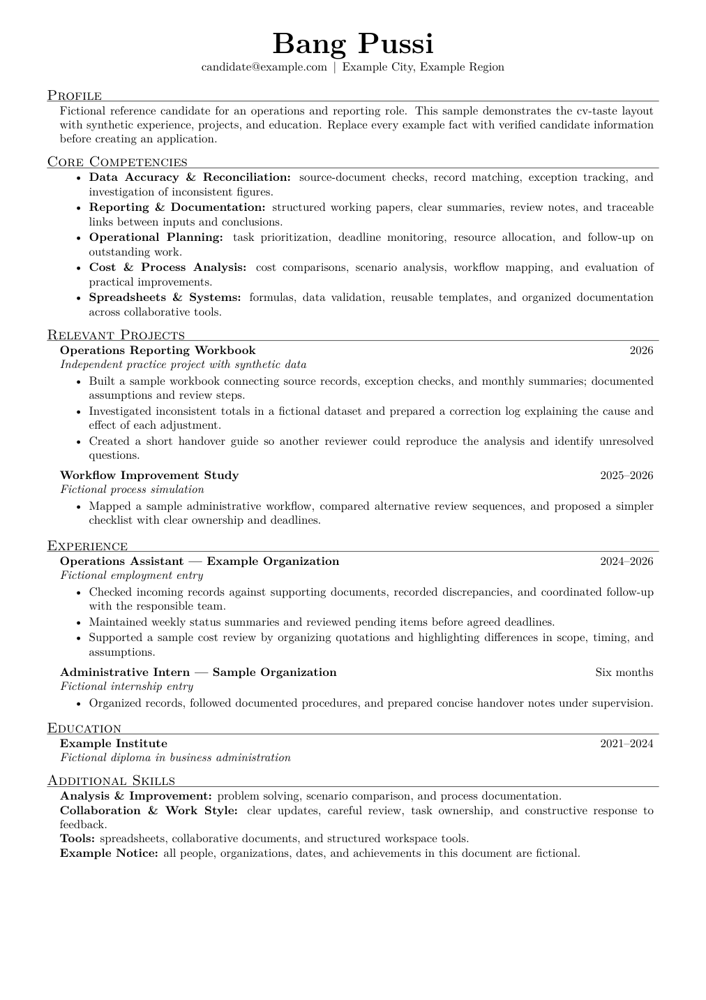

# cv-taste

**Unemployed, with taste.** A free CV toolkit to help you look sharp on paper. Tweak it. Make it you.

Start with the signature layout, tailor the content to your story, or contribute a new design. The current release includes a one-page Latin Modern Roman layout, role-specific writing guidance, and a small PDF renderer.

## Example

[](assets/reference.pdf)

[View the reference PDF](assets/reference.pdf) · [View the LaTeX source](assets/reference.tex)

The preview uses fictional candidate details. Use it for the design, then bring your own facts.

The repository contains a design and workflow, not a candidate profile. All example names, organizations, dates, and achievements are fictional. Supply current candidate facts separately for each application.

## Contents

| File | Purpose |
| --- | --- |
| `SKILL.md` | Activation, tailoring, design, review, and delivery instructions |
| `AGENTS.md` | Repository instructions for coding and writing agents |
| `assets/style.tex` | Shared document preamble and layout macros |
| `assets/reference.tex` | Fictional reference using the shared layout |
| `assets/reference.pdf` | Rendered reference with selectable text |
| `assets/reference-preview.png` | Visual reference |
| `scripts/render.py` | Compile, validate, extract text, and create a preview |
| `tests/test_render.py` | Checks for renderer failures and the reference contract |
| `skill.json` | Portable package metadata without workspace identifiers |
| `docs/publication.md` | Release and repository privacy guidance |
| `CHANGELOG.md` | Package changes |
| `LICENSE` | Free use and sharing; no resale of the package or templates |

## Install the skill

Clone the repository into the skill directory used by your agent or workspace:

```bash
git clone https://github.com/caelancarmer/cv-taste.git .agents/skills/cv-taste
```

Use your fork’s URL if you maintain a separate copy. Skill discovery varies by agent; installing a directory does not automatically enable it in every session. When using this repository directly as a workspace, `AGENTS.md` points to `SKILL.md`.

If your workspace needs explicit instructions, add:

```text
For CV or resume creation and tailoring, use .agents/skills/cv-taste/SKILL.md
unless the current request selects another style.
```

If the destination already exists, inspect its contents and local changes before updating it. Do not replace unrelated files.

Example request:

> Tailor a CV for this job description using cv-taste. Use the candidate facts I provide and discuss the draft in chat first.

## Dependencies

Use Python 3.10 or later and pdfLaTeX. The layout requires `lmodern`, `fontenc`, `inputenc`, `geometry`, `enumitem`, `microtype`, and `hyperref`. PyMuPDF provides PDF inspection and preview generation.

This release was validated on Linux. The following installation commands target Debian or Ubuntu:

```bash
sudo apt-get install texlive-latex-base texlive-latex-recommended lmodern
```

Install the Python dependency in your chosen environment:

```bash
python -m pip install -r requirements.txt
```

No web framework, database, JavaScript runtime, or Python HTTP package is required.

## Render the reference

Run from the repository root:

```bash
python scripts/render.py assets/reference.tex --output-dir /tmp/cv-taste-preview
```

The current renderer enforces the bundled one-page A4 Latin Modern design. Additional pages or different designs require corresponding renderer changes. Use trusted TeX sources; see the security note in `SKILL.md`.

The output directory receives the PDF, extracted text, preview PNG, validation JSON, and compiler files. Validation checks A4 page size, one page, allowed fonts, reference body font size, and text bounds. The report contains measured page count, text character count, fonts, minimum margins in points, and PDF byte size. Margins use font-height-normalized span boxes for consistent measurement across supported PyMuPDF versions; the top edge has the documented tolerance in `scripts/render.py`. See `SKILL.md` for review steps.

Run the renderer tests with:

```bash
python -m unittest discover -s tests -v
```

## Create a candidate CV

The source filename should use lowercase kebab-case, for example `candidate-cv-type-1.tex`.

Use `assets/style.tex` as the first input. It contains the document class and full preamble; do not add another `\documentclass`. Resolve its path relative to the candidate source directory, or use an absolute path in that local file.

```tex
\input{/path/to/cv-taste/assets/style.tex}
\hypersetup{pdftitle={Candidate CV},pdfauthor={Candidate Name}}
\begin{document}
\begin{center}
{\Huge\bfseries Candidate Name}\par
City, Region\enspace$|$\enspace candidate@example.com
\end{center}
\cvsection{Profile}
\begin{cvbody}
Write a concise, factual profile tailored to the target role.
\end{cvbody}
\end{document}
```

Replace the placeholder facts and metadata before delivery. Use the fictional reference for layout and section structure. Use the render command above with the absolute candidate source path and an output directory outside this repository.

## Delivery and maintenance

Follow the candidate-data rule and delivery workflow in `SKILL.md`.

See `AGENTS.md` for maintenance instructions.

## License

The current release uses the [cv-taste No-Resale License 1.0](LICENSE). You can use, modify, and share the toolkit for free, including for business use. You cannot sell the package, reusable templates, or modified versions, or put access to them behind a paywall.

Personalized CVs are yours to use and share without a cv-taste credit line. Paid CV-writing services are permitted when they deliver personalized CVs rather than the toolkit or reusable templates. This is a source-available project with a resale restriction, not an OSI-approved open-source license.

Third-party dependencies and fonts retain their own terms. PyMuPDF is separately licensed under GNU AGPLv3 or an Artifex commercial license; review [its licensing terms](https://pymupdf.readthedocs.io/en/latest/about.html) for your intended use, including integration into applications or services.

## Contribute

New designs, clearer guidance, and useful fixes are welcome. See `AGENTS.md` and the contribution terms in `LICENSE`. Supply only examples you have the right to share, and keep real candidate data outside the repository.

For a new design, include a fictional source, a PDF, and a preview, and explain any renderer changes needed. The bundled renderer currently validates the signature layout; additional designs need appropriate validation rather than a silent replacement of the default.

Read [publication guidance](docs/publication.md) before a release or visibility change.
